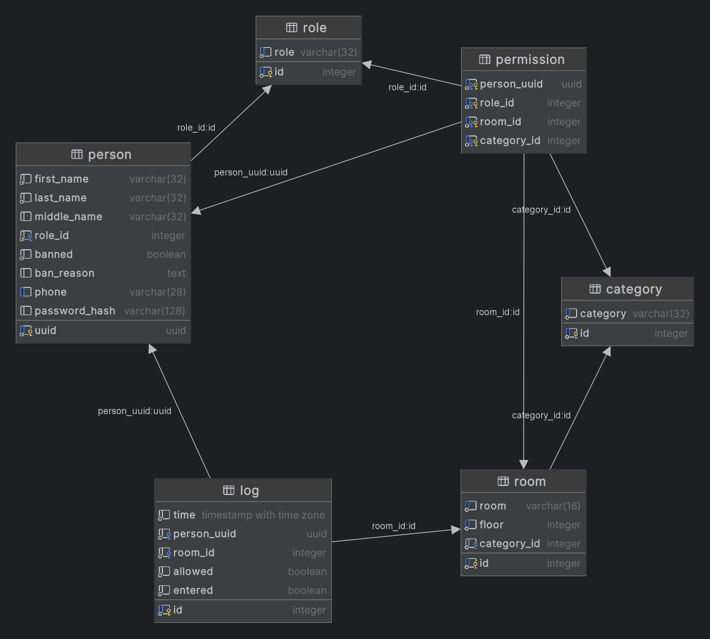

# Пропускная система (АИС КПП)

Пропускная система - это программная система, предназначенная для контроля помещений и безопаности.

# Содержание <a name="Содержание"></a>
* [Содержание](#Содержание)
* [Роли в команде](#Роли)
* [Стек технологий](#Стек)
* [База данных](#БДшка)
* [API и SWAGGER](#API_SWAGGER)
* [Макет веб-приложения](#Макет)
* [Docker](#Docker)

# Роли в команде <a name="Роли"></a>
* Тимлид [Кириченко Н.Д.](https://github.com/KirichenkoND)
* Frontend-Разработчик (Разработчик) [Кирилин Г.Д.](https://github.com/FaneOfficial)
* Frontend-Разработчик (Дизайнер) [Ганьшин Д.А.](https://github.com/Cooper-Farnsworth)
* Backend-Разработчик [Шустров В.Р.](https://github.com/ItsEthra)
* Тестировщик [Мигель Д.Г.](https://github.com/DooMiaN)
* Системный аналитик [Сафиуллин Т.И.](https://github.com/SafiullinT)
* Системный аналитик [Григорьев Н.А.](https://github.com/5ilen)

# Стек технологий <a name="Стек"></a>
В этом проекте используется следующий стек технологий:
* СУБД PostgreSQL
* React + TS + Vite
* Rust
* Figma

# База данных <a name="БДшка"></a>
В данной программной системе используется СУБД PostgreSQL.
Структура базы данных выглядит следующим образом:



# API и SWAGGER <a name="API_SWAGGER"></a>
Swagger расположен по следующей ссылке: [*swagger*](http://api.hospital.efbo.ru/swagger-ui/)

# Макет веб-приложения <a name="Макет"></a>
Макет веб-приложения расположен по следующей ссылке [*макет*](https://www.figma.com/file/0ZRSijy5h8b0xTVLDtl7Pj/%D0%9F%D0%BE%D0%BB%D0%B8%D0%BA%D0%BB%D0%B8%D0%BD%D0%B8%D0%BA%D0%B0?type=design&node-id=0-1&mode=design&t=rnU5u2QP7wvDrIpP-0)

## Описание макетов приложения
1. Авторизация


1. Список пациентов


1. Карточка пациента


1. Приём врача


1. Список врачей


1. Карточка врача


1. Расписание врача


1. Добавить врача


1. Медкарта пациента


# Docker <a name="Docker"></a>
Для сборки проекта необходимо скачать и установить docker. 
* Windows<br>Скачать с официального сайта Docker
* Linux<br>```sudo apt install docker```

# Сбор и запуск контейнера backend в Docker
```
cd backend
docker build -t hospital-backend .
docker run --name hospital-backend -e DATABASE_URL=<postgres_url> -d -p 9009:9000 hospital-backend
```

# Сбор и запуск контейнера frontend в Docker
```
cd frontend
docker build -t hospital-frontend .
docker run --name hospital-frontend -d -p 30000:3000 hospital-frontend
```